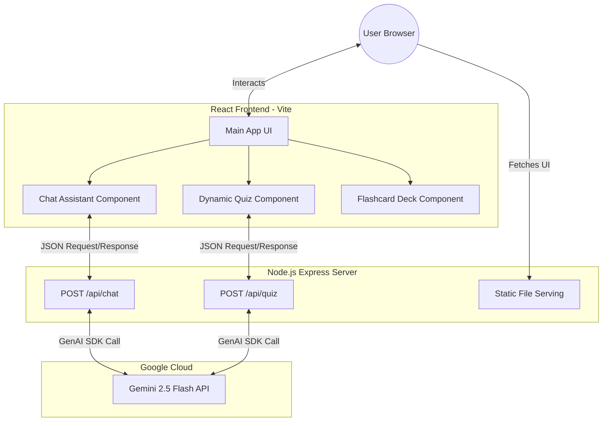

# Indian Election Assistant

An interactive, AI-powered educational web application designed to help citizens understand the **Indian Election System**. It features a modern, glassmorphism-inspired user interface with a subtle Indian tricolor theme. 

This project aims to simplify the electoral process, providing users with instant, reliable answers to their questions, flashcards for quick terminology checks, and dynamic gamified quizzes.

---

## 🚀 Key Features

- **Conversational AI Assistant**: Ask complex questions about the Election Commission of India (ECI), Model Code of Conduct, Electronic Voting Machines (EVMs), eligibility, and more. Powered by Google's Gemini AI.
- **Interactive Flashcards**: Smooth 3D CSS flip animations to quickly learn key election facts, acronyms, and terminology.
- **Dynamic Quizzes**: Real-time generated multiple-choice quizzes that adapt to test your knowledge, complete with a point-based scoring system and explanations.
- **Premium Design**: Fully responsive, modern vanilla CSS styling ensuring a beautiful experience across mobile and desktop devices.

## 🏗️ Architecture Diagram

The application uses a separated React frontend and Express backend, which are bundled together via a multi-stage Docker build for easy deployment on Google Cloud Run.



## 🛠️ Technology Stack
- **Frontend**: React.js, Vite, Vanilla CSS, React Router, Lucide React (Icons), React Markdown
- **Backend**: Node.js, Express.js, `@google/genai` SDK
- **Containerization & Deployment**: Docker, Google Cloud Run

## 💻 Local Development Setup

1. **Clone the repository**
   ```bash
   git clone https://github.com/Swati875/Indian-Election-Assistant.git
   cd Indian-Election-Assistant
   ```

2. **Set up Environment Variables**
   Create a `.env` file in the `backend/` directory and add your Google Gemini API key:
   ```env
   GEMINI_API_KEY=your_gemini_api_key_here
   ```

3. **Install Dependencies and Start**
   You can run the backend and frontend separately for development:
   
   **Start Backend:**
   ```bash
   cd backend
   npm install
   node server.js
   ```
   
   **Start Frontend:**
   ```bash
   cd frontend
   npm install
   npm run dev
   ```

## ☁️ Deployment (Google Cloud Run)

The repository includes a `Dockerfile` optimized for Google Cloud Run with multi-stage builds, health checks, and graceful shutdown.

1. Ensure the Google Cloud CLI (`gcloud`) is installed and authenticated.
2. Run the deployment command from the root of the project:
   ```bash
   gcloud run deploy election-assistant \
     --source . \
     --region us-central1 \
     --allow-unauthenticated \
     --set-env-vars="GEMINI_API_KEY=your_gemini_api_key_here" \
     --memory=512Mi \
     --cpu=1 \
     --min-instances=0 \
     --max-instances=5
   ```
3. Verify the deployment:
   ```bash
   # Check health endpoint
   curl https://YOUR_CLOUD_RUN_URL/api/health
   ```

## 🧪 Running Tests

```bash
# Backend tests (14 tests)
cd backend && npm test

# Frontend tests (13 tests)
cd frontend && npm test
```
